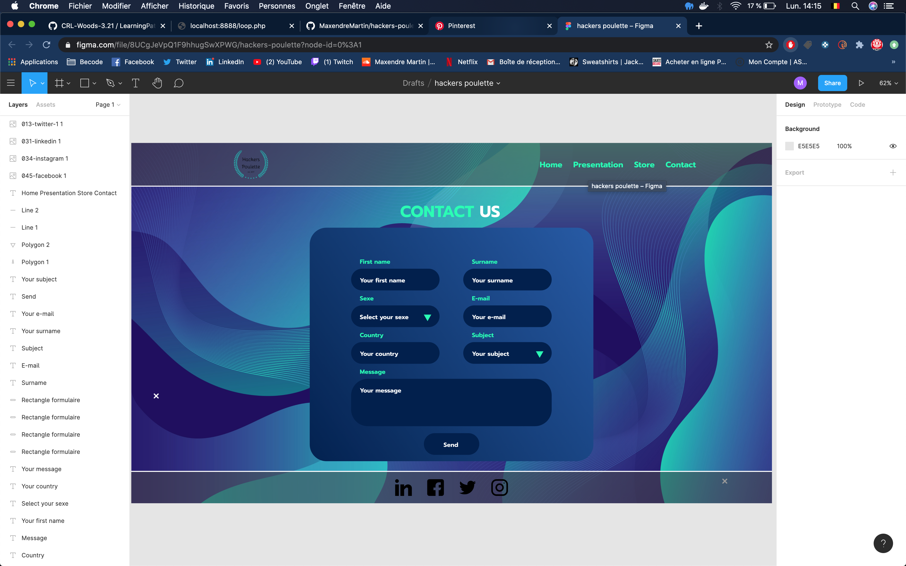

# hackers-poulette

-   Type of challenge: `consolidation`, SOLO
-   Duration: `3 days`
-   Deadline: `28/08/2020 17:00`
-   Host : https://www.heroku.com/ (or personnal host)

## The mission

My mission is to create a fully functional online "contact support" form, in _ PHP _. He must _ display a contact form _ and _ process the response received _ (sanitize, validate, respond to the user).

The form should be comprised of:

-   name and lastname
-   gender
-   email address
-   country
-   subject (3 possibilities)
-   message

## Here is the mockup what the page will look like

